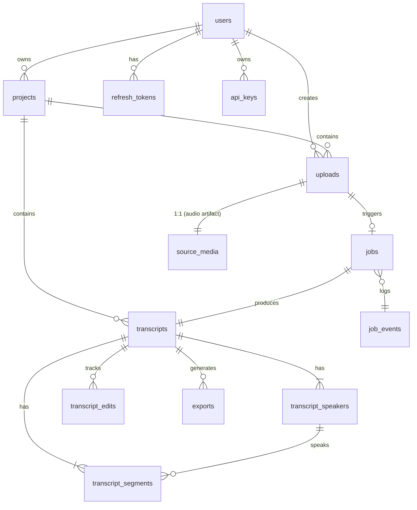

# Database Design

> Этап 2. Схема данных PostgreSQL. Часть `docs/architecture`.
> Зависит от: `system-design.md` (сущности и lifecycle).
> Статус: **на утверждение**.

---

## 1. Принципы

- **PostgreSQL 16**, UTF-8.
- Идентификаторы: `bigint identity` (snowflake-стиль не нужен на старте; сортировка по времени удобна).
- Время — `timestamptz` (UTC везде, форматирование на клиенте).
- Имена таблиц в `snake_case`, единственное число — нет (множественное: `users`, `projects`). Согласованность важнее грамматики.
- Ограничения целостности (FK, unique, check) — на уровне БД, не только в коде.
- Миграции — **Alembic** (autogenerate + ручная правка для DDL-ньюансов).
- Уникальные индексы для natural keys (`external_id`, `email`).
- `jsonb` — для опциональных/расширяемых полей (метаданные), но не для критичных путей запросов.
- **Мягкое удаление** (`deleted_at timestamptz`) там, где нужна история/аудит (пользователи, проекты, транскрипты). Сырые джобы — hard delete после TTL.

---

## 2. ER-диаграмма

---

## 3. Схема таблиц

### 3.1 `users`
| Колонка | Тип | Примечание |
|---|---|---|
| id | bigint identity PK | |
| email | citext unique not null | lowercase via citext |
| password_hash | text null | null для OAuth-only |
| name | text | |
| locale | text default 'ru' | 'ru' \| 'en' |
| avatar_url | text null | |
| email_verified_at | timestamptz null | |
| is_disabled | boolean default false | |
| created_at / updated_at | timestamptz | |

### 3.2 `refresh_tokens`
| Колонка | Тип | Примечание |
|---|---|---|
| id | bigint PK | |
| user_id | bigint FK → users on delete cascade | |
| token_hash | text not null | SHA-256 от токена; ничего не храним в открытом виде |
| family_id | bigint not null | для детектирования re-use (rotate family) |
| user_agent | text null | |
| ip | inet null | |
| expires_at | timestamptz not null | |
| revoked_at | timestamptz null | |
| created_at | timestamptz | |

Индексы: `(token_hash)` unique; `(user_id, family_id)`.

### 3.3 `oauth_accounts`
| Колонка | Тип | Примечание |
|---|---|---|
| id | bigint PK | |
| user_id | bigint FK → users | |
| provider | text | 'google' \| 'github' |
| provider_user_id | text | |
| provider_email | citext | |
| created_at | timestamptz | |
Unique: `(provider, provider_user_id)`.

### 3.4 `api_keys` (для будущего CLI/интеграций)
| Колонка | Тип | Примечание |
|---|---|---|
| id | bigint PK | |
| user_id | bigint FK → users | |
| key_hash | text not null | |
| name | text | |
| last_used_at | timestamptz null | |
| revoked_at | timestamptz null | |
| created_at | timestamptz | |

### 3.5 `projects`
| Колонка | Тип | Примечание |
|---|---|---|
| id | bigint PK | |
| user_id | bigint FK → users | |
| name | text | |
| default_language | text default 'ru' | 'ru' \| 'en' \| 'auto' |
| default_stt_model | text null | override по проекту |
| default_diarization | boolean default true | |
| created_at / updated_at | timestamptz | |
| deleted_at | timestamptz null | soft delete |

Индекс: `(user_id, deleted_at)`.

### 3.6 `uploads`
| Колонка | Тип | Примечание |
|---|---|---|
| id | bigint PK | |
| user_id | bigint FK → users | |
| project_id | bigint FK → projects null | |
| status | text check in ('pending','uploading','uploaded','aborted','corrupted') | |
| client_filename | text | оригинальное имя |
| client_mime | text | заявленный тип |
| client_duration_ms | int null | из browser probe |
| client_size_bytes | bigint null | |
| client_sha256 | text null | для дедупликации |
| kind | text check in ('audio','video') | |
| storage_key | text null | путь в object storage |
| storage_size_bytes | bigint null | фактический размер |
| storage_mime | text null | server-probe |
| storage_duration_ms | int null | server-probe |
| sample_rate_hz | int null | 16000 для извлечённого аудио |
| channels | int null | |
| created_at / updated_at | timestamptz | |

Индексы: `(user_id, created_at desc)`; `(client_sha256, user_id)` partial where not null (дедупликация).

### 3.7 `jobs`
| Колонка | Тип | Примечание |
|---|---|---|
| id | bigint PK | |
| user_id | bigint FK → users | |
| upload_id | bigint FK → uploads | |
| transcript_id | bigint FK → transcripts null | устанавливается при завершении |
| type | text check in ('transcribe','export','retry') | |
| status | text check in (FSM, см. system-design §4.1) | |
| progress_stage | text null | 'vad','chunking','stt','alignment','diarization','merge','postfix','finalize' |
| progress_percent | smallint default 0 check 0..100 | |
| stt_model | text | какой адаптер запускали |
| options | jsonb not null default '{}' | язык, диаризация, hotwords, beam и т.д. |
| error_code | text null | |
| error_message | text null | |
| attempt | int default 0 | |
| max_attempts | int default 3 | |
| worker_id | text null | для отладки |
| trace_id | text null | OpenTelemetry |
| started_at / finished_at | timestamptz null | |
| created_at / updated_at | timestamptz | |

Индексы:
- `(status, type)` partial where status in ('queued','running') — очередь берёт «жаждущих».
- `(user_id, created_at desc)` — список джобов пользователя.
- `(transcript_id)` — для повторного экспорта.

### 3.8 `job_events`
Журнал переходов состояний и событий прогресса. Полезен для отладки и для рендера таймлайна в UI.

| Колонка | Тип |
|---|---|
| id | bigint PK |
| job_id | bigint FK → jobs on delete cascade |
| event_type | text |
| payload | jsonb |
| created_at | timestamptz default now() |

Индекс: `(job_id, created_at)`. TTL-партицирование/удаление по возрасту (post-v1).

### 3.9 `transcripts`
| Колонка | Тип | Примечание |
|---|---|---|
| id | bigint PK | |
| project_id | bigint FK → projects null | |
| user_id | bigint FK → users | |
| upload_id | bigint FK → uploads null | если транскрипт импортирован вручную |
| title | text | |
| language | text | 'ru' \| 'en' \| ... |
| detected_language | text null | |
| duration_ms | int | длительность исходного аудио |
| stt_model | text | |
| status | text check in ('draft','ready','archived') | |
| version | int default 1 | optimistic concurrency для правок |
| word_count | int null | денормализация для UI |
| artifact_key | text null | путь к полному артефакту JSON в storage |
| created_at / updated_at | timestamptz | |
| deleted_at | timestamptz null | |

### 3.10 `transcript_speakers`
| Колонка | Тип | Примечание |
|---|---|---|
| id | bigint PK | |
| transcript_id | bigint FK → transcripts on delete cascade | |
| speaker_key | text | 'SPEAKER_00' из диаризации |
| display_name | text | редактируемое пользователем имя |
| created_at | timestamptz | |
Unique: `(transcript_id, speaker_key)`.

### 3.11 `transcript_segments`
Атомарная единица редактора. Один сегмент = одна речевая реплика одного спикера, со словами и таймкодами.

| Колонка | Тип | Примечание |
|---|---|---|
| id | bigint PK | |
| transcript_id | bigint FK → transcripts on delete cascade | |
| speaker_id | bigint FK → transcript_speakers null | |
| ordinal | int | позиция в транскрипте (для порядка без сортировки по времени) |
| start_ms | int not null | |
| end_ms | int not null | |
| text | text not null | финальный текст (с правками) |
| original_text | text not null | untouched STT-вывод (для diff/аудита) |
| confidence | real null | средняя уверенность слов |
| words | jsonb null | `[{w,t0,t1,conf}, ...]` для клик-по-слову |
| version | int default 1 | optimistic concurrency |
| updated_at | timestamptz | |

Индексы:
- `(transcript_id, ordinal)` unique — порядок и пагинация.
- `(transcript_id, start_ms)` — навигация по таймкоду (jump-to-time).

`words` как jsonb: обычно сегмент = 5–40 слов; jsonb достаточно. Если позже понадобится полнотекстовый поиск по словам — вынесем в отдельную таблицу или pg_trgm.

### 3.12 `transcript_edits` (журнал правок для autosave/undo)
Опционально в v1 можно жить без него (мягкое обновление `text` с `version`), но для undo-history полезен минимальный журнал.

| Колонка | Тип |
|---|---|
| id | bigint PK |
| segment_id | bigint FK → transcript_segments on delete cascade |
| user_id | bigint FK → users |
| prev_text | text |
| new_text | text |
| prev_version | int |
| created_at | timestamptz |

Партиция/Retention: хранить последние N правок на сегмент (cleanup-джоб).

### 3.13 `exports`
| Колонка | Тип | Примечание |
|---|---|---|
| id | bigint PK | |
| transcript_id | bigint FK → transcripts | |
| user_id | bigint FK → users | |
| format | text check in ('txt','docx','md','json','csv','srt','vtt','pdf') | |
| storage_key | text | путь к готовому файлу |
| mime | text | |
| size_bytes | bigint | |
| options | jsonb | напр. {speakers:true, timecodes:false} |
| expires_at | timestamptz | TTL для cleanup |
| created_at | timestamptz | |

Индекс: `(transcript_id, created_at desc)`.

---

## 4. Производительность и масштаб (расчёт)

- 1 час аудио ≈ ~400 сегментов по ~10 сек. 10 часов → ~4000 сегментов, ~30–120 тыс. слов.
- Текст сегмента: ~100 байт, words jsonb: ~1–3 КБ. Большой 10-часовой транскрипт → ~20–60 МБ в БД. Допустимо.
- **Streaming-загрузка редактора:** пагинация по `ordinal` (по 50 сегментов). Не тащим весь транскрипт в один запрос.
- **Поиск:** pg_trgm (`gin` на `text`) для быстрого поиска по сегментам транскрипта. Для пост-v1 — вынесенный поиск (Meilisearch/Typesense) если pg_trgm перестанет справляться.

### 4.1 Индексы — сводка критичных
| Таблица | Индекс | Зачем |
|---|---|---|
| users | unique(email) | логин |
| refresh_tokens | unique(token_hash) | валидация |
| uploads | (user_id, created_at desc) | список загрузок |
| jobs | partial(status in queued/running) | выборка очередью |
| jobs | (user_id, created_at desc) | UI-список джобов |
| transcript_segments | (transcript_id, ordinal) | порядок/пагинация |
| transcript_segments | (transcript_id, start_ms) | jump-to-time |
| transcript_segments | gin(text gin_trgm_ops) | поиск по транскрипту |

---

## 5. Миграции (Alembic)

- Каждая миграция — атомарный DDL; `up` и `down`.
- Большие изменения данных — отдельные data-migrations, не в DDL-файлах.
- На CI: `alembic upgrade head` на пустой БД + `alembic downgrade base` — проверка обратимости.
- seed-данные (справочники языков/моделей) — через `alembic seed`, не через фикстуры автогенерации.

### 5.1 Порядок создания
1. `0001_init_users_auth`
2. `0002_projects_uploads`
3. `0003_jobs_events`
4. `0004_transcripts_segments_speakers`
5. `0005_exports`
6. `0006_indexes_trgm`

---

## 6. Открытые вопросы

1. **Хранить `words` как jsonb или отдельной таблицей `transcript_words`?** jsonb проще, но усложняет точечные обновления слова (правка одного слова). В v1 — jsonb; вынести если понадобится пословное редактирование со своей историей.
2. **Хранить ли `original_text`?** Полезно для аналитики качества STT и diff-режима редактора. Оставляем, но согласовать.
3. **Retention пользовательских файлов в БД vs storage.** Политика удаления (GDPR/по умолчанию) — см. `security.md`.
4. **Multi-tenancy:** в v1 — фильтрация по `user_id` на уровне приложения + RLS отключён. На пост-v1 можно включить Row-Level Security как двойная защита.
