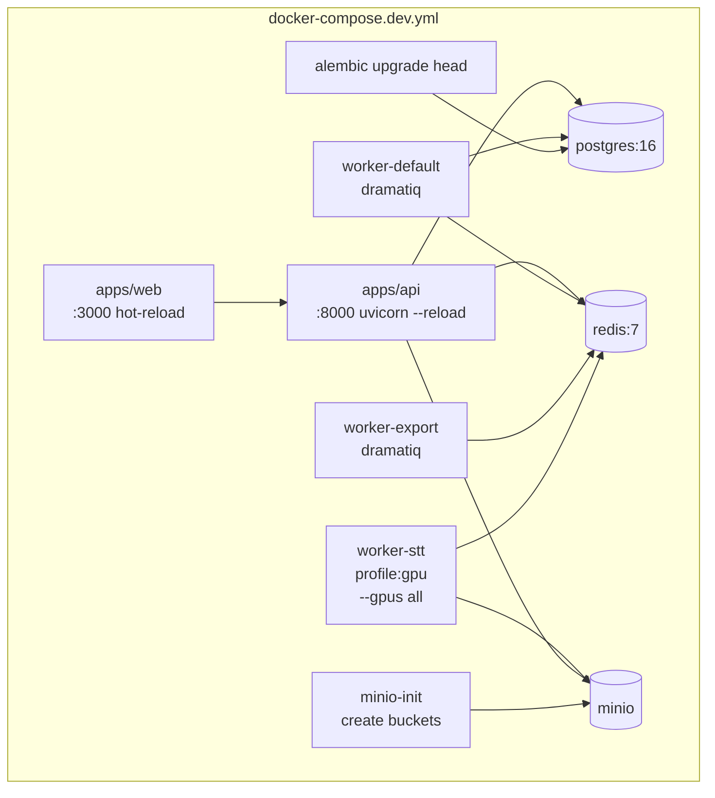
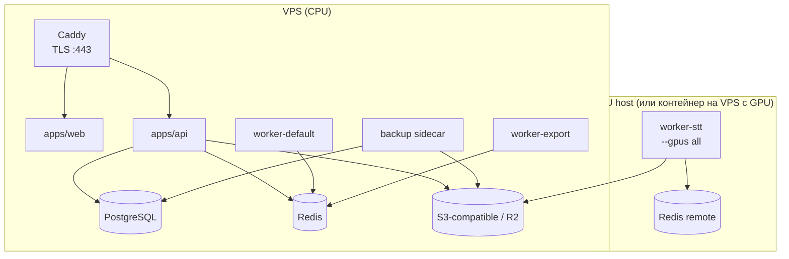

# Deployment

> Этап 2. Стратегия запуска, dev/prod compose, GPU, one-command start.
> Зависит от: `system-design.md` (topология), `queues.md` (воркеры), `storage.md` (MinIO).
> Статус: **на утверждение**.

---

## 1. Принципы

- **One-command start**: `make up` (или `docker compose up`) поднимает всё, что нужно для dev.
- **Один Dockerfile на сервис** (`apps/{web,api,worker,stt-service}/Dockerfile`).
- **GPU — опционально**: `docker-compose.dev.yml` запускается и без GPU (CPU-only STT, медленно). Профиль `gpu` включает GPU-воркер.
- **Идемпотентный bootstrap**: при старте создаются бакеты MinIO, применяются миграции (`alembic upgrade head`), seed-данные.
- **Без K8s** в v1. Команда `docker compose` + bash-скрипты для prod-рутина.
- **Конфигурация через env**, не через монтирование файлов секретов в образ.

---

## 2. Окружения

| Среда | Compose | Назначение | Особенности |
|---|---|---|---|
| Local dev | `docker-compose.dev.yml` (+ override) | Разработка, hot-reload | TomDoc-volumes, source mounts, debug, MinIO, self-signed TLS off |
| Prod (single VPS + GPU host) | `docker-compose.prod.yml` | Рабочая инсталляция | Caddy TLS, healthchecks, restart policies, log drivers |
| CI | `docker-compose.ci.yml` | Тесты | Изолированные БД/Redis, ephemeral |

### 2.1 Профили compose
- `gpu` — включает `worker-stt` с `--gpus all`.
- `cpu` (default) — CPU-only STT (для dev без GPU и CI).
- `observability` — Sentry/OTel collector (всегда в prod, опционально в dev).

---

## 3. Топология (dev)



Healthcheck-gates: `api` ждёт healthy `postgres`+`redis`; `worker-*` ждут healthy `api`.

---

## 4. Топология (prod)



В простейшем случае GPU-воркер работает на той же машине, что и остальное (`--gpus all` в compose). При росте — GPU выносится на отдельный хост, общается с тем же Redis (через private network/Tailscale).

---

## 5. One-command start (dev)

`Makefile` цели:
- `make up` — `docker compose -f docker-compose.dev.yml up -d` (+ wait healthchecks).
- `make down`, `make logs`, `make ps`.
- `make migrate` — применить миграции (также запускается при `up` через init-контейнер).
- `make seed` — демо-данные.
- `make test` — запуск unit+integration.
- `make lint`, `make fmt`.
- `make gpu-up` — то же, что `up`, с профилем `gpu`.

> Альтернатива без make — `scripts/dev.sh`. Makefile — для discoverability.

---

## 6. Образы

### 6.1 Базовые образы
| Сервис | Base | Почему |
|---|---|---|
| apps/web | `node:20-alpine` | маленький, быстрый |
| apps/api, apps/worker (default/export) | `python:3.12-slim` | размер + совместимость |
| apps/worker (stt) / apps/stt-service | `nvidia/cuda:12.x-cudnn-runtime-ubuntu22.04` + Python | нужные CUDA/cuDNN для Faster-Whisper/NeMo |
| postgres | `postgres:16-alpine` | официально |
| redis | `redis:7-alpine` | официально |
| minio | `minio/minio` | официально |

### 6.2 Многостадийные сборки
- `builder` — установка зависимостей (`uv` для Python, `pnpm`/`npm ci` для Node).
- `runtime` — только артефакты + runtime-зависимости.
- Кэш-слой для зависимостей (BuildKit cache mounts).

### 6.3 Размер / уязвимости
- `.dockerignore` на каждый сервис.
- Скан `trivy image` в CI.
- Pin версий в lock-файлах (`uv.lock`, `pnpm-lock.yaml`).

---

## 7. Конфигурация и секреты

### 7.1 Иерархия
1. `.env.example` — публичный шаблон с дефолтами для dev.
2. `.env` — gitignored, локальные секреты (dev).
3. Прод — env-vars из секрет-менеджера (Docker secrets / Vault / env-injected by orchestration).

### 7.2 Переменные (сводка)
| Категория | Переменные |
|---|---|
| DB | `DATABASE_URL`, `POSTGRES_USER/PASSWORD/DB` |
| Redis | `REDIS_URL` |
| S3 | `S3_ENDPOINT/REGION/ACCESS_KEY_ID/SECRET_ACCESS_KEY/BUCKET_*` |
| Auth | `JWT_SECRET`, `JWT_ACCESS_TTL`, `JWT_REFRESH_TTL`, `OAUTH_GOOGLE_*`, `OAUTH_GITHUB_*` |
| App | `APP_ENV`, `LOG_LEVEL`, `SENTRY_DSN`, `OTEL_EXPORTER_OTLP_ENDPOINT` |
| STT | `STT_MODEL`, `STT_DEVICE` (cuda/cpu), `STT_COMPUTE_TYPE` (float16/int8), `HUGGINGFACE_TOKEN` (для gated моделей) |
| Limits | `MAX_UPLOAD_BYTES`, `MAX_AUDIO_DURATION_HOURS`, `RATE_LIMIT_*` |

> Никаких секретов в образе. Все — runtime env.

---

## 8. Миграции и bootstrap

При старте `api` запускает init-контейнер `migrate`:
1. Ждёт healthy `postgres`.
2. `alembic upgrade head`.
3. Выходит с кодом 0; `api` стартует после.

MinIO bootstrap (контейнер `minio-init`):
1. Ждёт healthy `minio`.
2. `mc alias set ... && mc mb -p media artifacts exports && mc anonymous none ...`.
3. Применяет lifecycle-политики (`mc ilm rule add ...`).

---

## 9. GPU

- В compose для `worker-stt`:
  ```yaml
  deploy:
    resources:
      reservations:
        devices:
          - driver: nvidia
            count: all
            capabilities: [gpu]
  ```
- Фолбэк для dev-машины без GPU: профиль `cpu` использует тот же образ, но STT запускается на CPU (`STT_DEVICE=cpu`, `STT_COMPUTE_TYPE=int8`).
- Версии CUDA/cuDNN — согласованы с версиями `faster-whisper`/`onnxruntime-gpu`/`nemo`.

---

## 10. Логирование и наблюдаемость (детали в system-design §12)

- Docker log driver `json-file` с ротацией (`max-size: 50m`, `max-file: 5`).
- В prod — `gelf` или `loki` driver при наличии стека.
- Structured JSON-логи (`structlog` / pino для Next.js).
- Sentry DSN — обязателен в prod.
- OpenTelemetry collector (Tempo/Jaeger) — при включённом профиле observability.

---

## 11. Backup / restore

- **PostgreSQL**: `pg_dump` раз в сутки в Object Storage (`s3://backups/db/`), retention 14 дней.
- **MinIO/S3**: versioning на бакетах с артефактами и финальными транскриптами; для исходников — lifecycle в cold storage через 7 дней.
- **Restore runbook** в `docs/runbooks/restore.md` (создаётся на Этапе 16).

---

## 12. CI/CD

- CI (GitHub Actions):
  - lint + typecheck (ruff, mypy, eslint, tsc)
  - unit + integration tests
  - build образов (без push на PR)
  - `trivy` скан
  - `alembic upgrade head` then `downgrade base` на ephemeral Postgres (обратимость)
- CD:
  - На merge в `main`: build+push образов в registry (ghcr.io)
  - Prod-деплой: SSH + `docker compose -f docker-compose.prod.yml pull && up -d` (или watchtower для простоты). Post-v1 — нормальный CD pipeline.

---

## 13. Healthchecks

| Сервис | Endpoint | Что проверяет |
|---|---|---|
| api | `GET /health` | DB ping + Redis ping |
| worker (любой) | `dramatiq` middleware `/health` (TCP) | процесс жив |
| web | `GET /api/health` (Next.js route) | рендеринг |
| postgres/redis/minio | native | готовность |

`depends_on` с `condition: service_healthy` для предсказуемого старта.

---

## 14. Открытые вопросы

1. **Один VPS с GPU vs отдельный GPU-хост.** В v1 — что доступно; архитектура поддерживает оба варианта. Уточнить при подготовке prod-окружения.
2. **Caddy vs Nginx.** Предлагаю Caddy (авто-TLS, простой конфиг). Если есть предпочтения — обсудить.
3. **Registry.** ghcr.io по умолчанию (бесплатно для приватных образов).
4. **Observability-стек в v1.** Минимум — Sentry + структурированные логи. OTel/Tempo — опционально, включить когда станет тесно.
