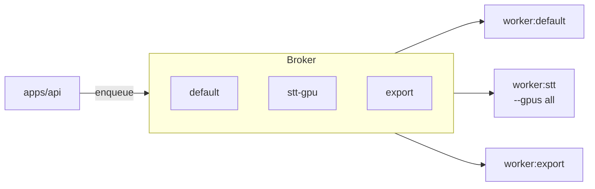
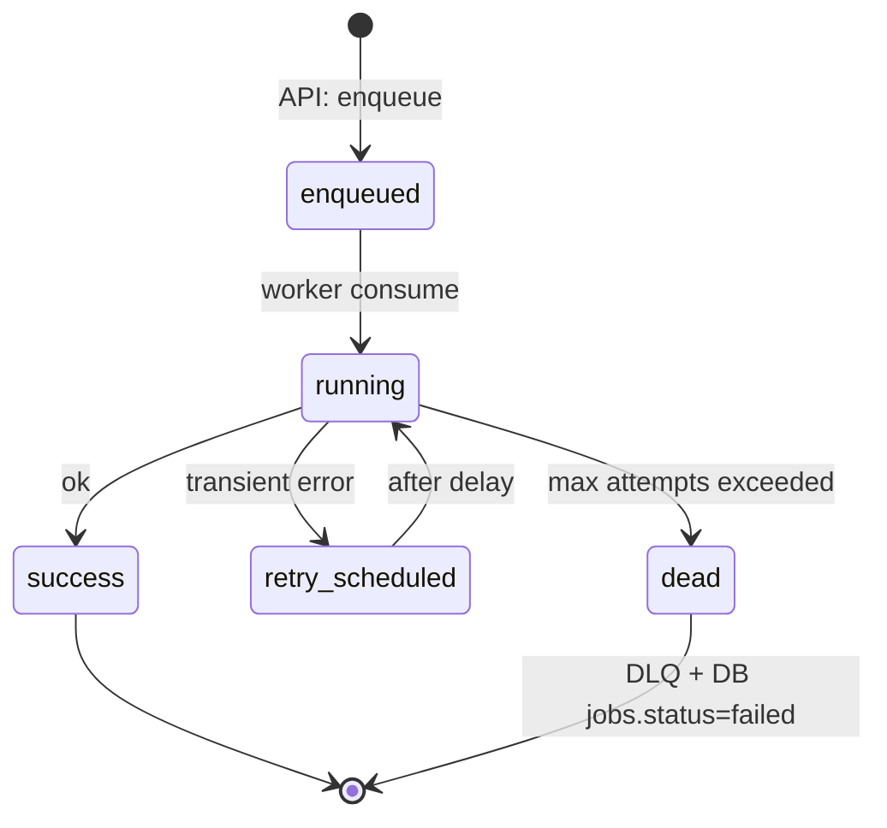
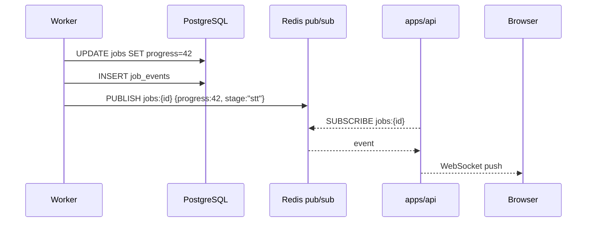

# Queues & Async Pipeline

> Этап 2. Очередь задач, topология воркеров, retry/DLQ, прогресс.
> Зависит от: `system-design.md` (pipeline, FSM), `database.md` (`jobs`, `job_events`).
> Статус: **на утверждение**.

---

## 1. Выбор стека

| Компонент | Выбор | Почему |
|---|---|---|
| Broker | **Redis 7+** | Уже нужен для pub/sub прогресса и кэша; не вводим RabbitMQ |
| Worker framework | **Dramatiq** | Прост, надёжен, предсказуемые retry/DLQ, middleware-модель. RQ — проще, но слабее по retry-семантике и observability |

Альтернативы, рассмотренные и отклонённые:
- **Celery**: тяжеловат, конфигурационные «магические» углы, избыточен для startup-масштаба.
- **RQ**: проще, но нет原生 middleware, хуже работа с приоритетами и DLQ; приемлемо, но Dramatiq чище.
- **Temporal/DBOS**: workflow-engine — слишком большая абстракция для v1.
- **Redis Streams directly**: слишком низкоуровнево, много ручной логики.

---

## 2. Топология очередей

Dramatiq понимает «actors» (обработчики) и «queues» (Redis-списки). В v1 — три именованные очереди, чтобы изолировать ресурсы:

| Очередь | Что исполняет | Воркер v1 | Ресурс |
|---|---|---|---|
| `default` | Лёгкие задачи: подготовка, normalize, VAD, merge, postfix, finalize | 1+ CPU-воркер | CPU |
| `stt-gpu` | STT, alignment, diarization | 1 GPU-воркер (`--gpus all`) | GPU |
| `export` | Генерация DOCX/PDF/SRT/... | 1 CPU-воркер (можно совмещать с `default`) | CPU |

Приоритизация внутри очереди — через Dramatiq `priority=` (мелкие задачи / healthcheck — выше).

---

## 3. Жизненный цикл задачи

- Статус в БД (`jobs.status`) — источник правды для UI.
- Статус в Dramatiq — источник правды для исполнения.
- Синхронизация: воркер обновляет `jobs.status` и пишет `job_events` на каждом переходе.

---

## 4. Actors (обработчики)

> Имена условные — фиксируются в коде на Этапе 7.

| Actor | Очередь | Вход | Что делает |
|---|---|---|---|
| `prepare_upload` | default | `upload_id` | ffprobe, нормализация, VAD |
| `chunk_audio` | default | `upload_id` | Разметка чанков, сохранение `chunks/*.json` |
| `transcribe_chunks` | stt-gpu | `job_id` | STT + alignment; пишет `raw_transcript.json`, `aligned.json` |
| `diarize` | stt-gpu | `job_id` | Speaker diarization → `diarization.json` |
| `merge_and_postfix` | default | `job_id` | Merge + пунктуация/регистр → `merged.json` |
| `finalize_transcript` | default | `job_id` | Создание `final.json`, запись сегментов в БД, `transcripts` status=ready |
| `export_transcript` | export | `transcript_id, format` | Генерация файла, presigned URL |

Координация:
- Один «оркестратор» актор `run_pipeline(job_id)` последовательно отправляет `message(...)` в нужные очереди, **не дожидаясь выполнения** в том же процессе — статус читается из БД.
- Альтернатива (рассмотреть): каждый этап сам enqueu'ит следующий по завершении (event-driven). В v1 — простой последовательный оркестратор, чтобы видеть трейс в одном месте.

---

## 5. Retry, backoff, DLQ

### 5.1 Политика retry
- **At-least-once** доставка. Акторы обязаны быть **идемпотентными** (см. `system-design.md` §7.3 — детерминированные ключи артефактов).
- Классификация ошибок:
  - `Transient` (сеть, Redis timeout, OOM-GPU, transient CUDA) → retry с экспоненциальным backoff.
  - `Permanent` (битый файл, неверный формат, missing model) → сразу `failed`, без retry.
- Параметры:
  - `max_retries = 3` (env), base delay 30с, factor 3, cap 10 мин, jitter ±20%.
  - На последней попытке — пометка `jobs.error_*`, статус `failed`, push в DLQ-очередь `dead`.

### 5.2 DLQ
- Dramatiq пишет необработанные сообщения в отдельную очередь `dead`.
- Раз в N минут отдельный actor-« могильщик» читает `dead`, ставит `jobs.status='failed'`, пишет `job_events` и удаляет сообщение.
- UI даёт пользователю «Retry» (создаёт новый джоб, с теми же опциями, attempt+1).

### 5.3 Тайм-ауты
- Per-actor `timeout` (мс):
  - `prepare_upload`/`chunk_audio`: 15 мин.
  - `transcribe_chunks`: 4 ч (10-часовой файл на медленном GPU).
  - `diarize`: 1 ч.
  - `export`: 10 мин.
- При таймауте — kill задачи, переход в retry.

---

## 6. Прогресс и события для UI

### 6.1 Каналы
- **WebSocket** `/ws/jobs/{id}` — основной канал прогресса; `/ws/transcripts/{id}` — обновления редактора.
- Воркер **не** шлёт в WebSocket напрямую (не имеет соединения). Паттерн:
  1. Воркер обновляет `jobs.progress_*` и пишет `job_events`.
  2. Воркер публикует событие в Redis pub/sub `jobs:{id}`.
  3. API подписан на `jobs:{id}`, ретранслирует в WebSocket клиенту.

### 6.2 Гранулярность прогресса
`progress_percent` считается по весам этапов (configurable):

| Этап | Вес |
|---|---|
| prepare/VAD/chunk | 10% |
| STT | 55% |
| alignment | 15% |
| diarization | 10% |
| merge/postfix | 7% |
| finalize | 3% |

Внутри STT прогресс пропорционален обработанным чанкам (`chunks_done / chunks_total`).

---

## 7. Масштабирование

- **CPU-воркеры** (`default`, `export`): горизонтально, по числу процессов `dramatiq --processes N --threads M`. По умолчанию 1 proc / 4 threads.
- **GPU-воркер** (`stt-gpu`): один процесс на GPU (модель в памяти), внутренняя очередь задач модели. Несколько GPU → несколько воркеров с разными `CUDA_VISIBLE_DEVICES`.
- **Брокер** Redis: один инстанс в v1. Post-v1 — Redis Cluster / managed Elasticache, если упрётся в память/пропускную способность.
- **Гибкость:** добавить воркер = поднять контейнер с тем же кодом и `QUEUES=stt-gpu`. Никаких правок в API.

---

## 8. Надёжность и предсказуемость

- **Идемпотентность**: ключи артефактов детерминированы; повторный запуск этапа перезаписывает результат. Чанки и сегменты в БД UPSERT по `(transcript_id, ordinal)`.
- **Resumability**: при рестарте воркера опрос `jobs` со статусом `running` и возобновление с `progress_stage` (воркер читает существующие артефакты, при наличии — пропускает этап).
- **Graceful shutdown**: SIGTERM → воркер дочитывает текущее сообщение, сохраняет `jobs.status='queued'` (если не успел завершить), выходит. Рекомендуемый timeout в compose: `stop_grace_period: 300s` для GPU-воркера.
- **Visibility timeout** (Dramatiq+Redis): достаточно длинный (≥ max runtime актора), чтобы один и тот же джоб не подхватился дважды.

---

## 9. Observability

- Каждый actor логирует `job_id`, `trace_id` (OpenTelemetry), длительность, статус.
- Метрики (post-v1): `dramatiq_messages_total{actor,status}`, `dramatiq_message_duration_seconds`, длина очереди (`LLEN`).
- Sentry: unhandled exceptions → Sentry + DLQ.
- Для отладки — `job_events` дают полный timeline джоба.

---

## 10. Открытые вопросы

1. **Оркестратор vs event-driven этапы.** Предлагаю явный последовательный оркестратор в v1 (`run_pipeline`). Альтернатива — каждый актор enqueu'ит следующий. Второе гибче при добавлении этапов, но сложнее отлаживать. Согласовать.
2. **Совмещать ли `default` и `export` очереди в одном воркере.** В v1 — да (один CPU-контейнер), упрощает деплой. При росте — разделить.
3. **Dramatiq vs RQ.** Выбран Dramatiq. Если есть сильные предпочтения по RQ — обсудить.
4. **Redis pub/sub vs WebSocket-from-worker.** Выбран pub/sub (воркер не знает про WS-клиентов). Альтернатива — отдельный gateway-сервис. В v1 — pub/sub достаточно.
