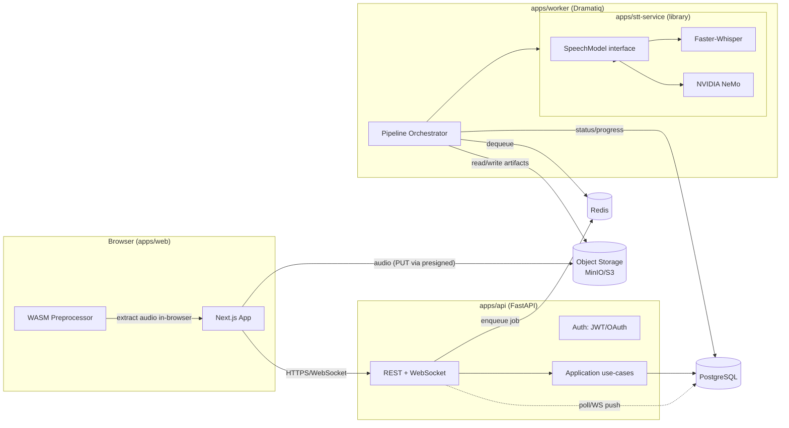
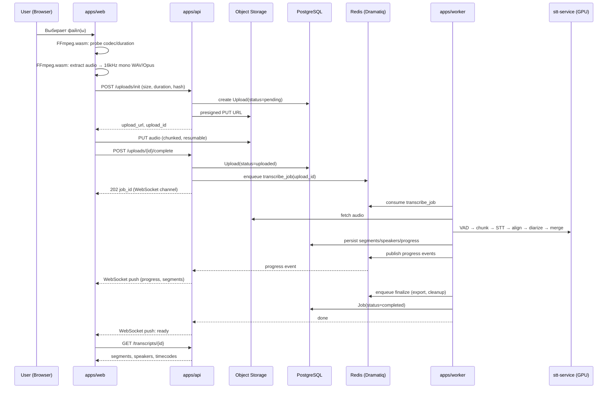
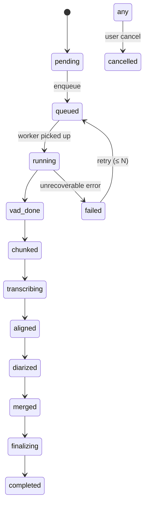
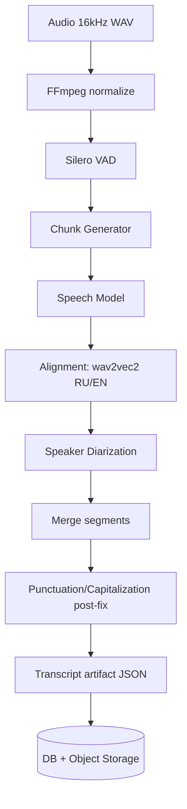
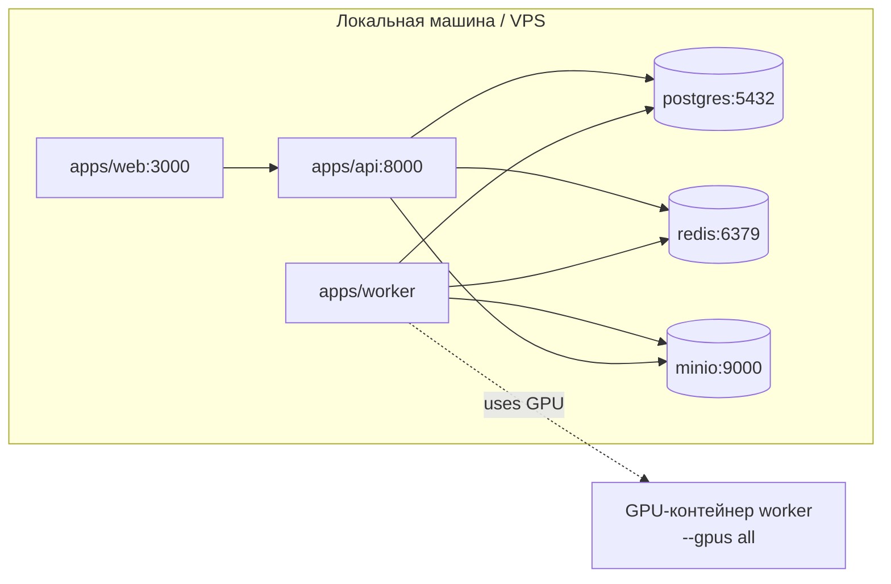

# System Design

> Этап 2. Высокоуровневая архитектура сервиса транскрибации длинных интервью.
> Статус: **на утверждение**. Без согласованной архитектуры код не пишется.

---

## 1. Контекст и ограничения

### 1.1 Что строим
SaaS для транскрибации длинных аудио/видео (от нескольких минут до **10 часов**), с фокусом на **русский язык** (вторично — английский), и удобным редактором транскрипта. Конкурентный уровень UX/качества — Notta, AssemblyAI, Otter, TurboScribe.

### 1.2 Зафиксированные решения (сессия 2026-07-20)
| Решение | Выбор | Обоснование |
|---|---|---|
| STT-стратегия | **Self-hosted GPU**, swappable `SpeechModel` | Контроль качества RU, себестоимость на объёме, соответствие требованию спецификации «лёгкая замена модели» |
| Масштаб v1 | **Dev-first, single `docker-compose`** | Стартап-масштаб без K8s, возможность роста. GPU — отдельный хост/контейнер |
| Языки v1 | **RU (primary) + EN** | Покрывает ~90% пользователей при минимальных затратах |
| Сессия | Документы Этапа 2, без кода | Согласно правилам: архитектура → утверждение → реализация |

### 1.3 Нефункциональные требования
- **NFR-1 Производительность.** 1 час аудио транскрибируется ≤ 5 мин на одном GPU (Faster-Whisper large-v3, fp16, ~RTF 0.03–0.05 на L4/A10).
- **NFR-2 Доступность.** v1 — best-effort; продакшен goal ≥ 99.5% (post-v1).
- **NFR-3 Масштабируемость.** Сервисы слабосвязаны через очередь; STT-воркеры горизонтально масштабируются по числу GPU.
- **NFR-4 Стоимость.** Никаких платных управляемых сервисов в v1. GPU только под нагрузкой (sleep в простое / spot для будущих сред).
- **NFR-5 Сопровождаемость.** Clean Architecture, SOLID, DRY, KISS. Один файл ≤ 300–500 строк, функция ≤ 40–60 строк.
- **NFR-6 Безопасность.** Изоляция пользовательских файлов, JWT + refresh, OAuth (Google, GitHub).
- **NFR-7 Расширяемость.** Замена STT/диаризации/VAD/чанкинга — через интерфейсы, без правок остального кода.

### 1.4 Out of scope (v1)
- Kubernetes, service mesh, многорегиональность.
- Биллинг/платежи (после product–market fit).
- Командная работа/совместное редактирование в реальном времени (CRDT).
- Мобильные приложения.
- Автоматический перевод/суммаризация (как post-v1 фичи пайплайна).

---

## 2. Архитектурный стиль

**Clean Architecture + модульный монолит на бэкенде, feature-first на фронтенде, сервисы-воркеры вокруг очереди.**

- Каждый сервис (`apps/api`, `apps/worker`, `apps/stt-service`, `apps/web`) — независимый процесс, разворачивается отдельно.
- Связь между ними — только через **PostgreSQL** (состояние) и **Redis/Dramatiq** (команды). Никаких прямых RPC между API и Worker (кроме healthcheck) — это устраняет coupling и упрощает масштабирование.
- `apps/stt-service` — библиотека/интерфейс + GPU-реализации, импортируется Worker'ом. Не отдельный сетевой сервис в v1 (см. ADR-003).

### 2.1 Слои внутри `apps/api` и `apps/worker`
```
presentation/   → HTTP-эндпоинты, WebSocket, DTO (Pydantic)
application/    → use-cases, оркестрация, бизнес-правила
domain/         → сущности, value objects, интерфейсы репозиториев
infrastructure/ → SQLAlchemy-репозитории, S3/MinIO, Redis, внешние SDK
```
Зависимости направлены внутрь (domain не знает ни о FastAPI, ни о SQLAlchemy).

---

## 3. Высокоуровневые компоненты



### 3.1 Роли компонентов

| Компонент | Технология | Ответственность |
|---|---|---|
| **apps/web** | Next.js 14 (App Router), React, TS, TailwindCSS, shadcn/ui, TanStack Query, Zustand, RHF, Framer Motion | UI: загрузка, редактор транскрипта, экспорт, настройки |
| **apps/api** | Python 3.12, FastAPI, Pydantic v2, SQLAlchemy 2.x, Alembic | REST/WebSocket API, аутентификация, orchestration use-cases, выдача presigned URLs |
| **apps/worker** | Python 3.12, Dramatiq + Redis broker | Исполнение пайплайна транскрибации, постобработка, экспорт |
| **apps/stt-service** | Python, абстракция `SpeechModel` + адаптеры (Faster-Whisper, NeMo) | Единый интерфейс к STT; инкапсулирует детали GPU/модели |
| **PostgreSQL** | 16 | Состояние: пользователи, проекты, джобы, сегменты, спикеры |
| **Redis** | 7+ | Broker очереди (Dramatiq), pub/sub для прогресса, cache/сессии |
| **Object Storage** | MinIO (dev) / S3-совместимый (prod) | Исходные файлы, артефакты пайплайна, экспорты |

### 3.2 Почему так

- **API и Worker разделены.** Тяжёлый STT не блокирует запросы; API остаётся отзывчивым; GPU изолирован.
- **Worker берёт работу из очереди, а не из API.** Нет временной связи, легко добавлять воркеры, переживает рестарт API.
- **`stt-service` — библиотека, а не сетевой микросервис.** Сетевой hop к GPU-сервису + сериализация тензоров — лишние накладные на single-host деплое. Интерфейс даёт ту же swappable-семантику безdistributed-ops overhead (см. ADR-003).
- **Object Storage, не БД для файлов.** Файлы до 10 часов — это гигабайты. БД хранит только пути + метаданные.

---

## 4. Жизненный цикл транскрибации (end-to-end)



### 4.1 Конечный автомат джобы

Состояние хранится в `jobs.status` (enum). Прогресс (0–100%) — отдельное поле, обновляется воркером по этапам.

---

## 5. Upload Pipeline (детально)

> Реализуется на Этапе 5 (frontend) и частично Этапе 6 (backend). Здесь фиксируем контракт.

### 5.1 Почему извлечение аудио в браузере
Видео до 10 часов весит гигабайты. Загружать его ради аудиодорожки — дорого и медленно. Поэтому:
1. Браузер через `FFmpeg.wasm` определяет кодек/длительность.
2. Извлекает аудио в **16 kHz моно** (формат, который нужен STT).
3. Кодирует в **Opus** (для транспорта; ~10× меньше PCM) или WAV (если Opus проблематичен в wasm).
4. На сервер идёт только аудио.

Видео (опционально) загружается **отдельно**, только если пользователь хочет синхронизацию плеера в редакторе.

### 5.2 Защита от злоупотреблений
- Сервер валидирует заявленный `duration` и `mime` против allow-list (audio/*, video/*).
- Presigned URL с TTL, single-use-стилем, ограничение размера (env: `MAX_UPLOAD_BYTES`).
- После заливки сервер перепроверяет заголовок (probe через `ffprobe`) и фактический размер.
- Ограничения на пользователя: параллельные загрузки, дневной лимит минут (env-configurable).

### 5.3 Resumable upload
- Multipart upload в S3/MinIO. Браузер переотправляет только незавершённые части.
- Контракт: `POST /uploads/init` → `{upload_id, parts[]}`; `PUT` каждой части; `POST /uploads/{id}/complete`.

---

## 6. STT Service (детально)

> Реализуется на Этапе 8. Здесь фиксируем интерфейс и стратегию адаптеров.

### 6.1 Интерфейс `SpeechModel`
```python
class SpeechModel(Protocol):
    name: str           # уникальный идентификатор адаптера
    languages: list[str]  # напр. ["ru", "en"]

    def transcribe(self, audio: AudioSegment, options: TranscribeOptions) -> TranscribeResult: ...
    def stream(self, audio_stream: Iterator[AudioFrame], options: TranscribeOptions) -> Iterator[PartialResult]: ...
    def estimate_time(self, duration_seconds: float) -> float: ...   # оценка wall-clock
    def estimate_cost(self, duration_seconds: float) -> Decimal: ...  # внутренняя себестоимость
```
- `AudioSegment` — общий внутренний формат (path | bytes | numpy PCM 16kHz mono).
- `TranscribeResult` — сегменты с timestamps, опционально слова, язык, средняя уверенность.
- Опции включают `language_hint`, `beam_size`, `vad`, `hotwords` (для RU имён/терминов).

### 6.2 Адаптеры v1
| Адаптер | Модель | Назначение |
|---|---|--- |
| `FasterWhisperModel` | `large-v3` (CTranslate2, fp16/int8) | **Дефолт** — лучший баланс RU-качество/скорость, зрелая экосистема |
| `FasterWhisperModel` | `large-v3-turbo` | Быстрая партия, RTF до 5–10× быстрее, слегка ниже точность |
| `NemoParakeetAdapter` | Parakeet-TDT (если подтверждена RU-поддержка) | Экспериментально; кандидата на замену дефолта |
| `NemoCanaryAdapter` | Canary-1B / flash | Мультилингвальный резерв, streaming |

> Решение о финальной дефолтной модели подтверждается данными из этапа исследования (WER/RTF на RU-датасетах). На старте — Faster-Whisper large-v3 как проверенный базель.

### 6.3 Жизненный цикл модели
- Загружается один раз при старте воркера (lazy init при первом джобе — для dev, eager для prod).
- На каждый GPU-воркер — одна модель в памяти; конкурентная обработка через внутреннюю очередь задач модели.
- Hot-swap: смена модели — это изменение env `STT_MODEL`, рестарт воркера. Никаких правок в API/фронтенде.

---

## 7. Pipeline обработки (детально)

> Реализуется на Этапе 9. Каждый шаг — отдельный модуль с интерфейсом и тестами.



### 7.1 Этапы
| # | Этап | Модуль | Интерфейс | Примечание |
|---|---|---|---|---|
| 1 | Normalize | `pipeline.normalize` | `Normalizer.normalize(path) -> Path` | 16 kHz mono, peak-normalize |
| 2 | VAD | `pipeline.vad` | `Vad.run(samples) -> list[VoiceRegion]` | Silero VAD v5; CPU-доступно |
| 3 | Chunking | `pipeline.chunking` | `Chunker.chunk(regions, audio) -> list[Chunk]` | Sliding/adaptive, overlap, защита от потерь слов на границах |
| 4 | STT | `stt_service` | `SpeechModel.transcribe(...)` | См. §6 |
| 5 | Alignment | `pipeline.alignment` | `Aligner.align(chunk, transcript) -> AlignedChunk` | WhisperX-стиль, wav2vec2 (RU/EN) |
| 6 | Diarization | `pipeline.diarization` | `Diarizer.assign(audio, regions) -> list[SpeakerTurn]` | pyannote 3.x / NeMo; выбор по лицензии |
| 7 | Merge | `pipeline.merge` | `Merger.merge(chunks, speakers) -> list[Segment]` | Разрешение оверлапов, склейка через границы |
| 8 | Post-fix | `pipeline.postfix` | `Postfix.fix(segments) -> list[Segment]` | Коррекция пунктуации/регистра под RU (правила + опц. LLM) |
| 9 | Export-ready artifact | `pipeline.artifact` | `ArtifactBuilder.build(...) -> Transcript` | Единая модель данных для БД и экспорта |

### 7.2 Управление GPU-памятью
- VAD/normalize/chunking — CPU, до STT.
- Только STT, alignment, diarization держат GPU. Запускаются последовательно в рамках джоба, чтобы не делить VRAM.
- `CUDA_VISIBLE_DEVICES` фиксирует GPU за воркером. Несколько воркеров = несколько процессов по одному GPU.

### 7.3 Идемпотентность и resumability
- Каждый этап пишет артефакт в Object Storage с детерминированным ключом (`jobs/{id}/aligned.json`).
- При рестарте воркера джоб возобновляется с последнего завершённого этапа (по `jobs.progress_stage`).
- Это делает воркер устойчивым к preemptible/spot GPU (важно для пост-v1 масштабирования).

---

## 8. Transcript Editor (детали на этапе 12)

Здесь фиксируем только контракты, влияющие на архитектуру:
- Транскрипт хранится как **immutable segments** + **diff-патчи правок** (для autosave и undo) либо soft-update с optimistic-concurrency (`version`).
- WebSocket-канал на джоб/транскрипт для пуша прогресса и обновлений сегментов.
- Клиент кэширует транскрипт в Zustand; autosave = debounced PATCH `/segments/{id}`.
- Переход по таймкоду = `?t=<sec>` + событие в плеер. Привязка слова → время хранится в `segment_words`.

---

## 9. Экспорт (детали на этапе 13)

- Экспорт выполняется **в Worker** (генерация DOCX/PDF тяжёлая).
- Триггер: `POST /transcripts/{id}/export?format=docx` → джоба `export_job`.
- Готовый файл кладётся в Object Storage, возвращается presigned GET (TTL).
- Форматы: TXT, DOCX (python-docx), Markdown, JSON, CSV, SRT, VTT, PDF (WeasyPrint/reportlab).

---

## 10. API (детали на этапе 14)

- **REST** для CRUD и команд.
- **WebSocket** (`/ws/jobs/{id}`, `/ws/transcripts/{id}`) для прогресса и live-обновлений редактора.
- **OpenAPI** автогенерируется FastAPI (`/docs`, `/openapi.json`).
- Версионирование: префикс `/api/v1`.

Контракты ключевых ресурсов:
- `/auth/*` — login, register, refresh, oauth callbacks
- `/projects` — CRUD проектов
- `/uploads/*` — init, parts, complete (см. §5)
- `/jobs/{id}` — статус, отмена, повтор
- `/transcripts/{id}` — чтение, правки, экспорт

---

## 11. Авторизация (детали на этапе 15)

- **Access token** (JWT, короткий TTL ~15 мин) + **refresh token** (rotating, ~30 дней, хэш в БД `refresh_tokens`).
- **OAuth**: Google, GitHub (Authorization Code + PKCE).
- Пароли — `argon2id` (через `passlib`).
- Все эндпоинты, кроме `/auth/*` и health, требуют валидного access token.

---

## 12. Наблюдаемость (этап 17)

- **Структурированные JSON-логи** (`structlog`).
- **Sentry** (Python SDK + Next.js) для ошибок.
- **OpenTelemetry** traces: вход в API → очередь → воркер → STT. Пробрасывается `traceparent` через метадату джоба.
- Метрики (post-v1): Prometheus-эндпоинт в API/воркере (`/metrics`).

---

## 13. Топология деплоя

### 13.1 Dev (single docker-compose)


### 13.2 Prod (минимально)
- API + web + Postgres + Redis + MinIO/S3 на одном VPS.
- Worker — отдельный контейнер/хост с GPU (`--gpus all`).
- Перед фронтендом — Caddy/Nginx (TLS, Let's Encrypt).
- Backup Postgres + MinIO по расписанию.

Подробнее — `deployment.md`.

---

## 14. Технологический стек (сводка)

| Слой | Технология | Версия (target) |
|---|---|---|
| Frontend | Next.js, React 18, TypeScript (strict), TailwindCSS, shadcn/ui | 14.x / 5.x |
| Frontend state/data | TanStack Query, Zustand, React Hook Form, Zod | latest |
| Frontend anim | Framer Motion | 11.x |
| In-browser media | FFmpeg.wasm (`@ffmpeg/ffmpeg`) | 0.12.x |
| Backend lang | Python | 3.12 |
| Web framework | FastAPI | 0.115+ |
| Validation | Pydantic | v2 |
| ORM / DB | SQLAlchemy 2.x + Alembic / PostgreSQL | 16 |
| Queue | Dramatiq + Redis | 1.17+ / 7.x |
| STT | Faster-Whisper (CTranslate2), NeMo (резерв) | latest stable |
| VAD | Silero VAD | v5 |
| Alignment | WhisperX / wav2vec2 | latest |
| Diarization | pyannote.audio 3.x / NeMo | latest (по лицензии) |
| Observability | structlog + Sentry + OpenTelemetry | latest |
| Container | Docker, docker-compose | 24+ / v2 |

---

## 15. Ключевые архитектурные решения (ADR summary)

Полные тексты — отдельными ADR в `docs/architecture/adr/`. Кратко:

| ADR | Решение | Статус |
|---|---|---|
| ADR-001 | Clean Architecture + модульный бэкенд, feature-first фронт | Proposed |
| ADR-002 | Очередь (Dramatiq+Redis) как единственная связь API↔Worker | Proposed |
| ADR-003 | `stt-service` — библиотека в Worker, не сетевой сервис (single-host) | Proposed |
| ADR-004 | Извлечение аудио в браузере (FFmpeg.wasm) | Proposed |
| ADR-005 | Self-hosted GPU, swappable `SpeechModel` | Accepted (locked) |
| ADR-006 | Dev-first single `docker-compose`; GPU в отдельном воркере | Accepted (locked) |
| ADR-007 | Faster-Whisper large-v3 как дефолт STT | Proposed (подтвердить этапом 1) |

---

## 16. Риски и митигация

| Риск | Вероятность | Влияние | Митигация |
|---|---|---|---|
| FFmpeg.wasm медленный/тяжёлый на больших файлах | Средняя | Высокая | Стриминг-чанкинг в wasm, fallback на серверное извлечение при размере > N |
| pyannote лицензия блокирует коммерцию | Средняя | Высокая | Резерв: NeMo diarizer / Sortformer / 3D-Speaker |
| Дефицит GPU в simple-деплое | Средняя | Средняя | Поддержка CPU-only режима (Faster-Whisper int8 на CPU, медленнее) |
| Разрастание «богатых» моделей → нехватка VRAM | Низкая | Высокая | Один воркер = одна модель; disk swap моделей |
| Потеря слов на границах чанков | Средняя | Средняя | Overlap + merge по пересечению; покрытие тестами |
| Долгий (10ч) джоб падает посередине | Средняя | Высокая | Resumable pipeline (§7.3), идемпотентные этапы |
| RU-пунктуация/числа плохи «из коробки» | Высокая | Средняя | Этап post-fix (правила + опционально LLM) |

---

## 17. Что нужно утвердить до старта реализации

Перед переходом к Этапу 3 (структура проекта) и коду необходимо подтверждение:
1. **Разделение сервисов и интерфейсы** (§3, §6) — ок?
2. **Browser-side audio extraction** как подход по умолчанию (§5) — ок?
3. **`stt-service` как библиотека, а не микросервис** (ADR-003) — ок?
4. **Faster-Whisper large-v3 как стартовый дефолт** с возможностью замены (ADR-007) — ок?
5. **Resumable pipeline с чекпойнтами в Object Storage** (§7.3) — ок, или упростить до «рестарт с нуля» в v1?
6. **Диаризация через pyannote** с резервом NeMo (по лицензии) — ок?
7. **Топология single-compose dev / VPS+GPU prod** (§13) — ок?

Следующие документы (`database.md`, `storage.md`, `queues.md`, `deployment.md`, `security.md`) детализируют части этой схемы и должны читаться вместе с этим файлом.
